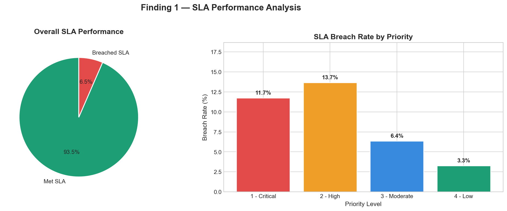
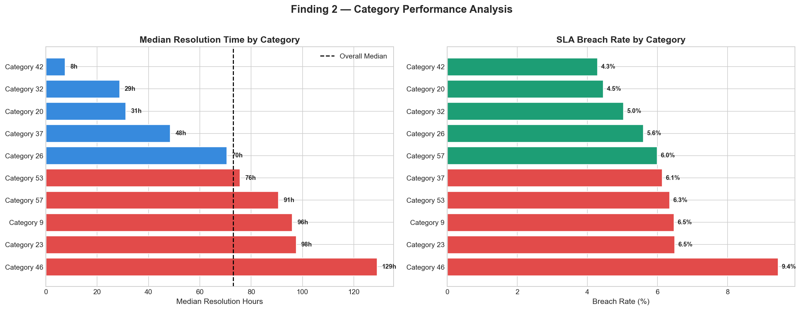
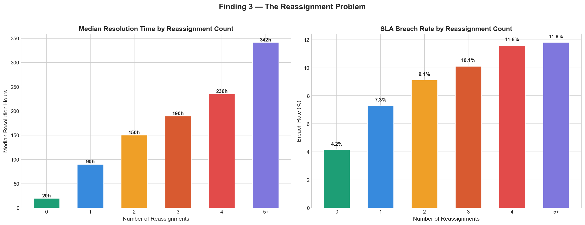
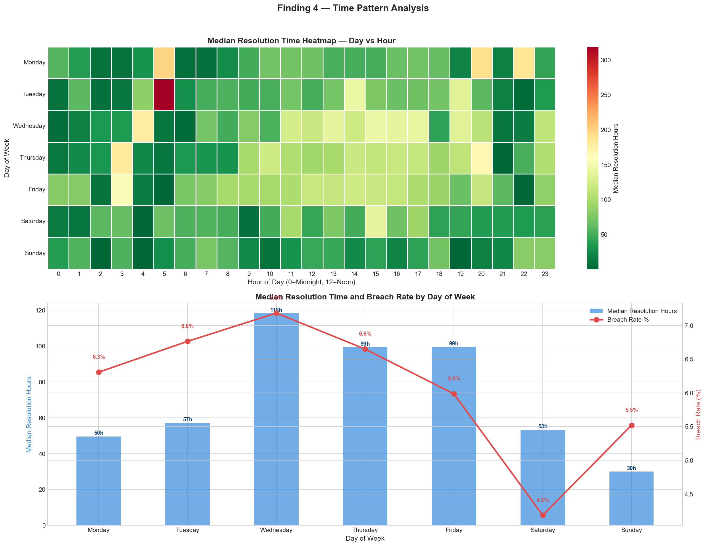
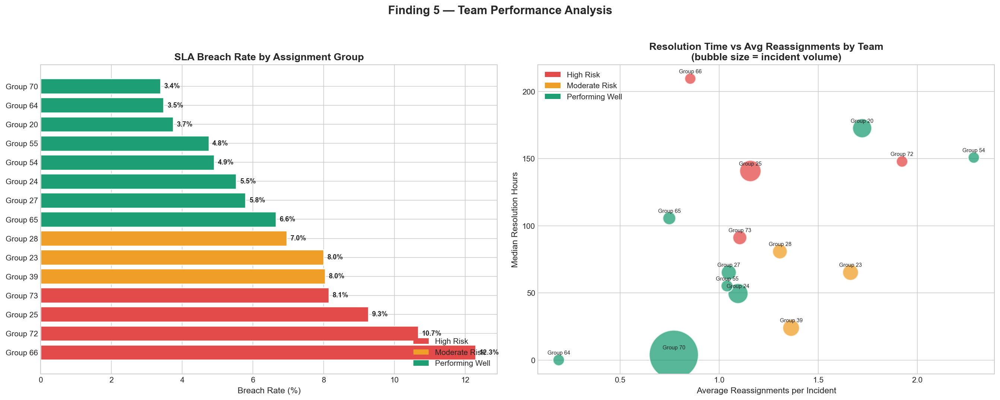

# it-incident-analytics
Analysing 23,362 real IT incidents to identify root causes of SLA breach using Python and SQL
# IT Incident Management Analytics
### Uncovering Root Causes of SLA Breach from 23,362 Real IT Incidents

---

## Project Overview

This project analyses a real-world IT incident management dataset 
extracted from a ServiceNow platform used by a telecom company. 
The goal is to identify the root causes of SLA breaches and 
provide data-backed recommendations to improve IT operations 
performance.

This project was chosen deliberately — as a former Site Reliability 
Engineer I have lived this data. I understand incident escalations, 
SLA commitments, on-call rotations and reassignment workflows from 
direct professional experience. That domain knowledge informed every 
analytical decision made in this project.

---

## Dataset

| Property | Detail |
|---|---|
| Source | UCI Machine Learning Repository |
| Link | https://archive.ics.uci.edu/dataset/498/incident+management+process+enriched+event+log |
| Records | 141,712 events across 24,918 incidents |
| Attributes | 36 columns |
| Domain | IT Service Management — ServiceNow Platform |
| License | CC BY 4.0 |

---

## Tools and Technologies

| Tool | Purpose |
|---|---|
| Python | Core analysis language |
| Pandas | Data cleaning and manipulation |
| Matplotlib | Chart creation and styling |
| Seaborn | Heatmaps and advanced visualisation |
| SQL | Querying and validating findings |
| Power BI | Interactive executive dashboard |
| Jupyter Lab | Development environment |

---

## Business Questions Answered

1. What is the overall SLA breach rate and which priority 
   level breaches the most?
2. Which incident categories take the longest to resolve 
   and have the highest breach rate?
3. Does reassigning a ticket increase resolution time — 
   and where is the tipping point?
4. Which days and hours have the worst resolution times?
5. Which support teams are underperforming on SLA and 
   which should be the internal benchmark?

---

## Key Findings

### Dataset Overview
- Total unique incidents analysed — 23,362
- Overall SLA breach rate — 6.5%
- Median resolution time — 73.5 hours
- Longest resolution time — 8,070 hours (336 days)

---

### Finding 1 — The Priority Blind Spot
Priority 2 High incidents breach SLA more than Priority 1 
Critical — 13.7% vs 11.7%.

Critical incidents trigger immediate all-hands response. 
High priority incidents are treated as less urgent and 
quietly accumulate in queues until they breach SLA without 
anyone noticing.

---

### Finding 2 — Category 46 is a Double Confirmed Problem
Category 46 has both the longest median resolution time 
(129 hours) and the highest SLA breach rate (9.4%) among 
all top 10 categories by volume.

Double confirmation across two independent metrics rules 
out statistical coincidence — this is a systemic process 
failure specific to this category.

---

### Finding 3 — The Reassignment Tipping Point
A single reassignment multiplies resolution time 4.5x — 
from 20 hours to 90 hours. By the third reassignment, 
breach rate has more than doubled from 4.2% to 10.1%.

| Reassignments | Median Resolution | Breach Rate |
|---|---|---|
| 0 | 20 hours | 4.2% |
| 1 | 90 hours | 7.3% |
| 2 | 150 hours | 9.1% |
| 3 | 190 hours | 10.1% |
| 4 | 236 hours | 11.6% |
| 5+ | 342 hours | 11.8% |

---

### Finding 4 — The Wednesday Crisis
Wednesday has the highest median resolution time at 118 
hours and the highest breach rate at 7.2% — not Friday 
as commonly assumed.

Incidents accumulate from Monday and Tuesday creating a 
mid-week backlog bottleneck. Friday actually has the 
lowest weekday breach rate at 5.99%.

---

### Finding 5 — Team Performance Tiers
Four teams are classified as High Risk based on breach 
rate — Group 66, Group 72, Group 25, and Group 73.

Group 70 is the star performer — handling 40,384 incidents 
at only 3.4% breach rate and 3.9 hour median resolution 
time. Their process should be studied and replicated.

Group 66 shows high resolution time with low reassignments 
suggesting a capacity or skill gap rather than a routing 
problem — requiring different intervention than Group 72 
which shows a clear reassignment routing issue.

---

## Top 3 Business Recommendations

**Recommendation 1 — Implement a Maximum Reassignment Policy**
Cap reassignments at 2. On the third reassignment, 
automatically escalate to a senior resolver rather than 
another lateral handover. This single intervention could 
reduce breach rate from 10.1% to closer to 4.2% for 
affected incidents.

**Recommendation 2 — Investigate Category 46 Urgently**
Category 46 is the only category confirmed worst on both 
resolution time and breach rate simultaneously. A focused 
process review — including staffing levels, skill mapping 
and routing rules — should be prioritised above all other 
category interventions.

**Recommendation 3 — Address the Wednesday Bottleneck**
Review ticket allocation and team capacity specifically 
for Wednesday. Consider load balancing non-urgent tickets 
raised Monday and Tuesday to prevent mid-week accumulation. 
Reducing Wednesday's median resolution time to Monday 
levels would reduce overall breach rate by an estimated 
0.8 percentage points.

---

## Project Structure
